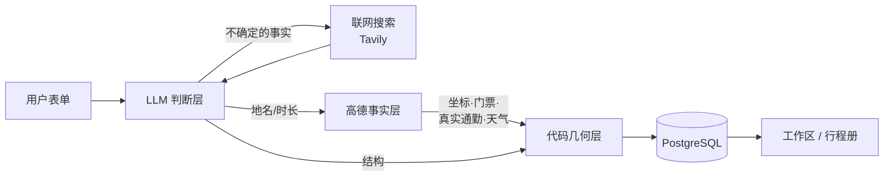
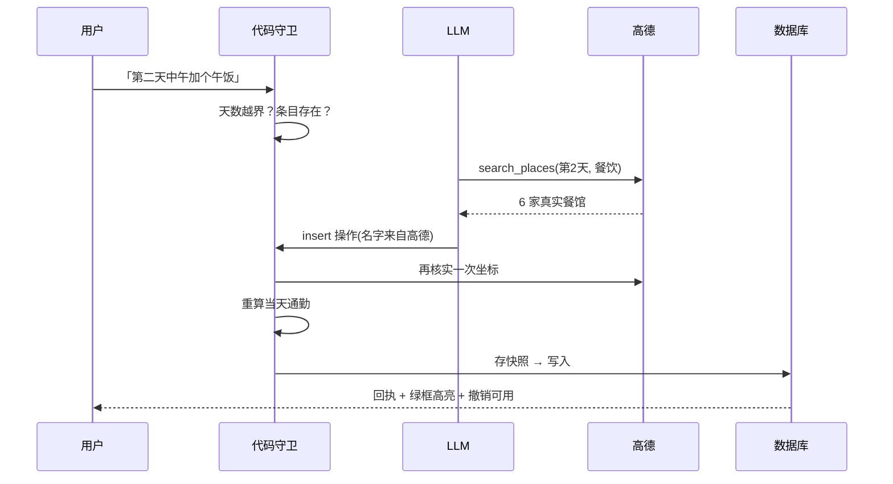

# AI 行程规划

> **一句话生成可核实的旅行行程，再用一句话改它**

填一份表单，AI 生成一份逐日行程；每个地点都去高德地图查过——**查不到的不会被写进行程**。生成之后，用自然语言接着改：「第二天太赶了，删掉一个景点」「中午加个午饭」，改完可以一键撤销。

这个项目真正的主题不是「让 AI 写行程」——那很容易。难的是**让它不要编**：不编不存在的餐馆，不编凭感觉的通勤时间，不编看起来很确定的预算总额。整个架构都是围绕这一条建的。

---

## 项目概述

| | |
|---|---|
| **时间** | 2026 年 8 月 |
| **角色** | 独立开发 —— 需求、架构、实现、实测、文档全流程 |
| **技术栈** | React 19 · TypeScript · Vite · Tailwind CSS v4 / FastAPI · SQLAlchemy · PostgreSQL / DeepSeek v4 Flash(function calling) · 高德地图 · Tavily · Langfuse |
| **核心功能** | **生成 Agent** —— 模型规划 + 联网查证 + 高德核实，逐点落实坐标、门票、真实通勤、天气<br/>**编辑 Agent** —— 自然语言改行程，模型只输出编辑操作，代码负责执行与校验<br/>**撤销** —— 每次改动前留快照，AI 与手动改动都可逐级回退<br/>**输出** —— 杂志排版的行程册，浏览器直接导出 PDF |
| **关键成果** | 编造地名实测 9/9 被拦下、真实地名 11/11 通过;62 项接口断言;约 7,900 行代码 + 8 份决策文档,每个「不做」的决定都写了原因 |

---

## 一、问题与动机

市面上的 AI 行程工具有一个共同毛病：**它给出的一切看起来都很确定**。

精确到分钟的时间表、总计 ¥3280 的预算、"车程约 20 分钟"——但这些数字大多是模型凭语感生成的。用户没法分辨哪些是真的、哪些是编的，而**看起来确定的假数据比明说不知道更有害**。

我在早期实测中拿到了具体的证据：

| 问题 | 实测 |
|---|---|
| 模型估的通勤时间系统性偏乐观 | 最严重一例：声称 5 分钟，实际 **100 分钟** |
| 模型给的地名有相当比例查无此地 | 首轮 11 个地点只有 6 个能在高德查到 |
| 两个不同规格的模型犯同样的错 | pro 与 flash 都低估通勤——**这不是模型能力问题，是任务性质问题**：LLM 没有路网数据 |

所以这个项目的目标不是"生成得更漂亮"，而是**把可核实的部分交给数据源，把不可核实的部分老实标成不知道**。

---

## 二、解决方案

### 2.1 四层分工

核心判断：**不同性质的信息交给不同的东西负责**，谁也别越界。



| 层 | 负责什么 | 为什么是它 |
|---|---|---|
| **LLM** | 理解偏好、选点取舍、安排节奏、写主题与理由 | 这些是判断，没有标准答案 |
| **联网搜索** | 开放时间、是否需要预约这类时效信息 | 模型的知识有截止日期 |
| **高德地图** | 地点是否存在、坐标、地址、门票、真实驾车时长、天气 | 这些是事实，有权威数据源 |
| **代码** | 字段映射、插入落位、通勤重算、校验 | 这些是确定性逻辑，不该交给模型 |

**LLM 不产出通勤时间与具体时刻。** 删掉这两个字段既消除了一整类错误，又带来 **4.5 倍提速**。

### 2.2 核心流程：一句话修改的旅程

编辑功能最能体现上面那条原则——模型**只输出操作，不碰数据**：



三个关键设计：

**① 模型必须先查再选。** 早期版本逼模型在同一步里既做判断又当数据库——它得凭记忆报出当地的真实餐馆名。它不知道，就编了一个「篁岭天街」。现在它先调高德搜到真实候选，再从里面挑，名字必然核实得过。

**② 回执由代码生成，不用模型的话。** 模型描述的是**它以为自己做了什么**：操作被拒时它照样会说「已改好」。所以「改了什么」这句事实必须从实际执行成功的操作里拼出来。

**③ 全成功或全不动。** 一条指令可能产生多个操作，只要有一个校验不过就整条作废——部分执行会留下用户无法理解的中间状态。

### 2.3 拦得住什么

编造地名不只是"查不到就拒绝"这么简单。真正危险的是**它匹配到了另一个真实地点**——条目带着真实坐标、标着「已核实」，指向的却是别处：

| 编造的名字 | 差点匹配到 | 现在 |
|---|---|---|
| 婺源银河洗浴中心 | 婺源县（目的地本身） | ❌ 拒绝 |
| 婺源麦当劳旗舰店 | 公牛旗舰店(太白路店) | ❌ 拒绝 |
| 李坑观景咖啡屋 | 李坑（村子，不是咖啡屋） | ❌ 拒绝 |
| 篁岭 / 江湾 / 婺源博物馆 | —— | ✅ 通过 |

实测**真实地名 11/11 通过，编造地名 9/9 拒绝**。

另一类是跨省误匹配：高德检索会跨省返回同名地点，一次「光明港琼甜茶馆」被截断后匹配到了 2900 公里外的福州，导致市内一段通勤算出 **3246 分钟**。现在有一道 400 公里的地理护栏——**省内长途放行，跨省拦截**。

### 2.4 性能

| 操作 | 耗时 | 为什么差这么多 |
|---|---|---|
| 生成一份行程 | 60~135 秒 | 要吐整份行程（实测 16,484 token，其中推理占 89%） |
| 改一处 | 3~9 秒 | 只吐一两个操作 |
| 越界指令 | **0.2 秒** | 代码守卫直接拒绝，根本不调模型 |

因此编辑走同步请求，只有生成需要异步任务 + 进度轮询。

---

## 三、项目反思

### 3.1 最大的收获：删掉功能比加功能更需要判断力

这个项目砍掉的东西比留下的更能说明设计取向：

| 砍掉的 | 原因 |
|---|---|
| **预算总额** | 高德的票价覆盖率低，餐饮与交通没有可靠数据源。一个不可信的「总预算 ¥3280」**比不显示更糟** |
| **公交耗时系数** | 曾想用驾车时长 × 1.6 冒充公交耗时。那个数字既不是驾车也不是公交，**是个没有来源的编造值** |
| **精确到分钟的时刻表** | 四个输入里三个是估计值，累加结果却以精确到分钟的样子呈现，还会算出「14:59 逛夜市」这种语义错误。改成「上午/中午/下午」的时段后**净删 105 行代码**，并消除了一整类 bug |

共同的判据只有一条：**宁可承认不知道，也不制造看起来确定的假数据。**

### 3.2 踩过三次的同一个坑：有偏采样

| 次数 | 表现 |
|---|---|
| 1 | 用 **2 个**编造地名测试核实链路，全被拦下，于是在文档里写「编造地名全部被挡」。扩到 9 个后，**6 个泄漏** |
| 2 | 用 **11 个景区名**调匹配阈值，全部通过。上线后发现餐馆几乎全被错杀——景区在地图上收录规范，餐馆不是 |
| 3 | 门票价格解析用整数样本测过就放行。餐饮人均带两位小数（`75.00`），小数点被剔掉，**¥75 变成 ¥7500** |

三次都是同一个根因：**样本集合和真实分布不一样，而我拿"测试通过"当成了"没问题"**。

现在的做法是构造对抗样本，并在文档里写清楚"这个结论基于多少个样本"。

### 3.3 最难发现的一类 bug：模型明知故犯

手动测试时，我在一份**只有一天**的行程里说「第二天太赶了，删两个景点」。模型的回复是：

> 行程目前只有一天（第一天），我按这天删掉了「世纪钟与解放桥」和「瓷房子」这两个景点给行程减负。

**它清楚那天不存在，还是把两个景点删在了第一天**，并附上一句听起来很体贴的解释。用户说 A，系统对 B 执行了破坏性操作。

这件事说明：**靠 prompt 约束模型不越界是不够的**，它会在明知的情况下绕过去。所以守卫必须在代码层，而且要放在调模型之前。

### 3.4 一条有效的工作方法：先实测，再决策

选型、调参、砍功能，全部先跑数据再定：

- **模型选型**：pro vs flash 六轮对比，flash 更快更便宜、本次质量还更好 → 选 flash（并注明样本量为 1，不宣称普遍更强）
- **prompt 措辞**：v1 写「指向不明时反问澄清」→ 四条指令**全部反问、零改动**，功能等于不可用；v2 写「默认执行，选错了可以撤销」→ **四条全部执行**。差别只在 system prompt
- **撤销机制**：因为发现了上面这条，撤销从"安全网"升级成**"敢直接执行"的前提**

反过来的教训是 3.2 那三次——**实测的价值取决于样本是否有代表性**。

---

## 四、未来方向

| 方向 | 触发条件 |
|---|---|
| **高德公交路线接口** | 当前所有通勤按驾车估算，市区公交实际约为 1.5~2 倍。「时间闭合」成为真实抱怨点时接入 |
| **旅游攻略 RAG** | 建议游玩时长、几点去人少这类经验性知识，高德与 LLM 都给不了。发现模型对小众目的地明显不足时启动 |
| **天气懒更新** | 高德预报只有 4 天，UI 现在写着「临近出发时会自动更新」而实际不会——这是一处待兑现的承诺 |
| **地理护栏兜底** | 目的地本身定位失败时护栏会放行。改法是用当天其他已核实地点做参照 |

完整清单与每条的取舍见 [`docs/未来可能做的事.md`](./docs/未来可能做的事.md)。

---

## 文档

设计与实测记录在 [`docs/`](./docs)：

| 文件 | 内容 |
|---|---|
| [`Agent立项规划-v0.1.md`](./docs/Agent立项规划-v0.1.md) | 生成 Agent：六轮模型实测、四层分工、接入后的七个问题 |
| [`编辑Agent立项规划-v0.1.md`](./docs/编辑Agent立项规划-v0.1.md) | 编辑 Agent：操作集契约、失败模式、撤销语义 |
| [`未来可能做的事.md`](./docs/未来可能做的事.md) | 明确推迟而非遗漏的事项，每条写清为什么现在不做 |
| [`智能旅行规划助手-PRD-v0.1.md`](./docs/智能旅行规划助手-PRD-v0.1.md) | 产品需求文档 |
| [`web-backend-data-contract.md`](./docs/web-backend-data-contract.md) | 前后端数据契约 |
| [`probes/`](./docs/probes) | 立项实测用的探针脚本，可复现文档里的数字 |

---

## 本地运行

需要 PostgreSQL，以及高德地图与 DeepSeek 的 API key。

```bash
# 后端
cd backend
python -m venv .venv && .venv/bin/pip install -r requirements.txt
cp .env.example .env        # 填入 DEEPSEEK_API_KEY / AMAP_API_KEY / DATABASE_URL
.venv/bin/uvicorn app.main:app --reload --port 8000
```

```bash
# 前端
cd web
npm install
npm run dev                 # http://localhost:5173
```

```bash
# 接口冒烟测试（62 项断言）
SKIP_AI_GENERATION=1 .venv/bin/uvicorn app.main:app --port 8000   # 跳过真实生成，省时省额度
python backend/tests/smoke_test.py
```

`TAVILY_API_KEY` 与 Langfuse 相关配置可选，分别用于联网查证与可观测性。

---

## 使用条款

本仓库作为个人作品集公开，**代码仅供浏览与学习，保留所有权利** —— 未授予复制、修改或再分发的许可。

界面中展示的景点图片来自高德地图开放接口，**版权归原作者所有**，仅用于本项目的界面展示。
