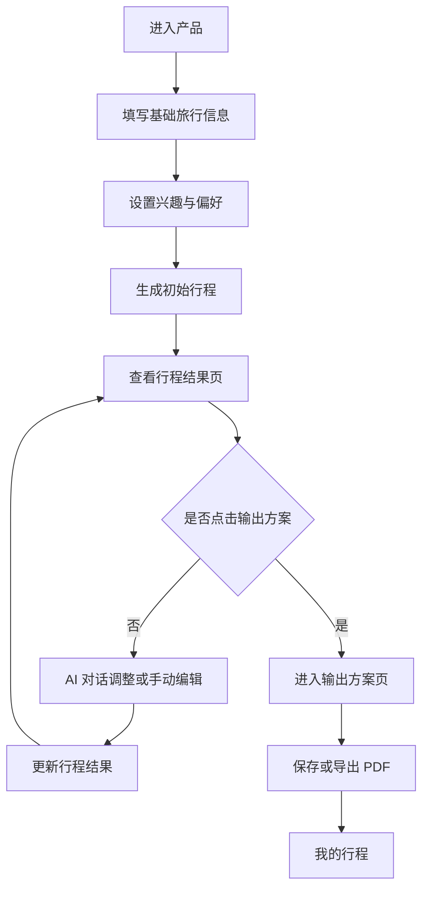

# 智能旅行规划助手 PRD v0.1

> ⚠️ **这是 2026-08 立项期的需求文档，记录当初打算做什么。**
> 落地状态逐条标注在第 14 章；当前实现请看根目录 `README.md`。
> 保留原文不改写，是为了让「当初的设想」与「最后的取舍」都能看到。

## 1. 文档说明

### 1.1 文档目的

本文档用于指导“智能旅行规划助手”作品集项目的产品设计、Figma 原型设计和后续前后端实现。

PRD v0.1 的重点不是覆盖所有商业化功能，而是明确第一版 MVP 的核心流程、页面结构、功能需求、数据来源和技术拆分，确保后续 Figma 设计和 vibecoding 开发有清晰依据。

### 1.2 项目性质

个人学习与作品集项目。

项目目标是完整实践：

- 产品定义
- PRD 编写
- Figma 低保真与高保真设计
- 前端 Mock 实现
- 后端接口实现
- AI 行程生成
- 高德 API 地图路线能力接入
- 独立天气 API 能力接入
- PDF 导出
- 作品集包装

### 1.3 版本范围

当前版本为 v0.1，面向 MVP。

MVP 目标是跑通核心闭环：

```text
用户输入旅行偏好
→ AI 推荐景点并生成初始行程
→ 高德补全景点坐标和路线
→ 天气 API 补全目的地天气
→ 用户在行程结果页多轮编辑
→ 用户点击“输出方案”
→ 系统生成美观旅行计划
→ 用户保存或导出 PDF
```

## 2. 产品定位

### 2.1 产品名称

智能旅行规划助手。

后续品牌设计阶段可再命名。

### 2.2 产品定位

一个以“AI 协作生成 + 可视化行程表”为核心的智能旅行规划工具。

用户输入人数、目的地、旅行天数、兴趣偏好、旅行节奏和自定义需求后，系统自动推荐合适的景点，并结合地图位置、路线耗时和天气信息生成初始旅行计划。用户可以继续通过 AI 对话和手动编辑反复调整，直到点击“输出方案”，最终生成一份包含地图、路线、时间、天气、每日安排和预算概览的美观旅行计划，并支持导出为 PDF。

### 2.3 核心主张

不是生成一段旅行攻略，而是把用户的旅行偏好转化为一份可编辑、可验证路线、可导出的精美旅行计划。

## 3. 目标用户

### 3.1 核心用户

20-35 岁、计划 2-5 天城市自由行、愿意自己微调行程、但不想花大量时间查攻略和排路线的用户。

### 3.2 用户特征

- 熟悉小红书、地图、日历、Notion 等工具
- 会参考攻略，但不想手动整理所有信息
- 更关注自由行体验，而不是跟团式固定路线
- 需要一个可修改的初稿，而不是一次性聊天答案
- 希望最终计划足够好看，适合查看、分享或打印

### 3.3 主要使用场景

- 周末去一个城市玩 2-3 天
- 假期去一个国内城市玩 3-5 天
- 和朋友、伴侣或家人出行，需要快速生成可讨论的计划
- 做作品集 Demo 时展示完整 AI 产品设计与落地能力

## 4. MVP 范围

### 4.1 MVP 必须包含

- 创建旅行计划
- 收集目的地、人数、天数、兴趣、节奏、自定义偏好
- AI 推荐景点并生成初始结构化行程
- 展示每日行程时间线
- 展示地图点位、景点顺序、路线耗时
- 展示天气概览
- 支持 AI 对话调整
- 支持手动编辑行程
- 支持多轮迭代，直到点击“输出方案”
- 输出美观旅行计划
- 保存行程
- 导出 PDF

### 4.2 MVP 暂不包含

- 用户真实支付
- 酒店、机票、门票预订
- 多人实时协作
- 社交发布
- 实时导航
- 实时拥堵预测
- 海外地图完整覆盖
- 高精度分钟级天气预报
- 原生移动 App

### 4.3 分阶段实现建议

阶段 1：前端 Mock 版

- 使用静态 Mock 数据完成全流程
- 先验证页面结构、交互和视觉
- 不接真实 AI 和高德 API

阶段 2：AI 生成版

- 接入 AI 生成结构化行程
- 支持初始行程生成和局部重生成
- 高德相关字段可先继续 Mock

阶段 3：地图路线与天气 API 版

- 接入 POI 搜索
- 接入经纬度补全
- 接入路线耗时
- 接入独立天气 API

阶段 4：PDF 与作品集包装

- 完成输出方案页
- 完成 PDF 导出
- 整理作品集说明、设计稿和 Demo

## 5. 用户流程

### 5.1 主流程



### 5.2 核心状态流转

- 草稿状态：用户填写旅行信息但尚未生成
- 生成中状态：系统正在生成初始计划
- 可编辑状态：用户查看并多轮调整行程
- 输出预览状态：用户点击“输出方案”后查看最终计划
- 已保存状态：行程保存到“我的行程”
- 已导出状态：用户完成 PDF 导出

## 6. 页面清单

### 6.1 页面列表

| 页面 | 页面目标 | 是否进入 MVP |
|---|---|---|
| 首页 / 创建行程页 | 让用户快速开始创建旅行计划 | 是 |
| 偏好设置页 | 收集影响行程质量的关键偏好 | 是 |
| 生成中页面 | 给用户明确等待反馈 | 是 |
| 行程结果页 | 展示、编辑、AI 调整行程 | 是 |
| 景点详情弹窗 | 查看和编辑单个景点信息 | 是 |
| 输出方案页 | 展示最终美观计划 | 是 |
| 我的行程页 | 管理已保存行程 | 是，简版 |
| 登录注册页 | 用户账户体系 | 否，后置 |
| 分享页 | 对外分享行程 | 否，后置 |

## 7. 页面需求

### 7.1 首页 / 创建行程页

页面目标：

- 让用户快速输入基础旅行信息
- 降低开始门槛
- 明确下一步是生成旅行计划

页面字段：

| 字段 | 类型 | 是否必填 | 数据来源 | 说明 |
|---|---|---|---|---|
| 目的地 | 输入框 | 是 | 用户输入 | 城市或区域，例如杭州、成都、东京 |
| 出行人数 | 数字选择器 | 是 | 用户输入 | 默认 2 人 |
| 旅行天数 | 数字选择器 | 是 | 用户输入 | MVP 建议 2-5 天 |
| 出行日期 | 日期选择 | 否 | 用户输入 | 如填写则用于天气查询 |
| 预算 | 输入框 | 否 | 用户输入 | 用于预算估算和节奏控制 |
| 旅行节奏 | 单选 | 是 | 用户选择 | 轻松、适中、紧凑 |
| 兴趣快速选择 | 多选标签 | 是 | 用户选择 | 美食、自然、博物馆、购物等 |

主要操作：

- 点击“下一步”：进入偏好设置页
- 点击“生成计划”：如果做单页流程，也可直接提交

校验规则：

- 目的地不能为空
- 旅行天数必须大于 0
- 出行人数必须大于 0
- 至少选择一个兴趣标签

异常状态：

- 字段缺失：在对应字段下方提示
- 目的地无法识别：提示用户换成城市名或更具体地点

### 7.2 偏好设置页

页面目标：

- 收集更细的旅行偏好
- 让 AI 生成结果更贴合用户需求

页面字段：

| 字段 | 类型 | 是否必填 | 数据来源 | 说明 |
|---|---|---|---|---|
| 同行人类型 | 多选 | 否 | 用户选择 | 朋友、情侣、亲子、老人、独自旅行 |
| 必去景点 | 标签输入 | 否 | 用户输入 | 用户一定想去的景点 |
| 不想去景点 | 标签输入 | 否 | 用户输入 | 用户希望避开的景点 |
| 饮食偏好 | 多选 | 否 | 用户选择 | 本地小吃、咖啡、素食、清真等 |
| 出行方式偏好 | 单选 | 否 | 用户选择 | 步行优先、公共交通、打车优先 |
| 自定义偏好 | 文本框 | 否 | 用户输入 | 例如“不要太累”“想多拍照” |

主要操作：

- 点击“生成旅行计划”：进入生成中页面
- 返回上一页：回到创建行程页

### 7.3 生成中页面

页面目标：

- 缓解等待焦虑
- 告诉用户系统正在做什么
- 为 AI 与地图路线能力建立信任感

生成步骤文案：

- 分析旅行偏好
- 推荐合适景点
- 补全地图位置
- 计算路线耗时
- 匹配天气信息
- 生成每日计划

状态规则：

- 正常生成：展示进度步骤
- 生成失败：提供“重新生成”和“返回修改需求”
- 生成时间过长：提示“规划稍微复杂，正在继续整理”

### 7.4 行程结果页

页面目标：

- 作为用户反复打磨旅行方案的主工作台
- 展示 AI 生成结果
- 支持多轮 AI 调整和手动编辑
- 用户满意后点击“输出方案”

页面布局建议：

- 顶部：目的地、日期、人数、预算、输出方案按钮
- 左侧或主区域：每日行程时间线
- 右侧或辅助区域：地图、路线摘要、天气、预算概览
- 底部或侧边：AI 调整输入框

核心模块：

| 模块 | 内容 | 数据来源 |
|---|---|---|
| 日期 Tabs | Day 1、Day 2、Day 3 | AI/后端 |
| 每日概览 | 当日主题、摘要、天气 | AI/天气 API |
| 时间线 | 时间、景点、停留时长、交通耗时 | AI/高德 |
| 景点卡片 | 名称、类型、推荐理由、预算 | AI/高德 |
| 地图概览 | 点位、访问顺序、路线连线 | 高德/前端 |
| 路线摘要 | 总距离、总交通时间、分段路线 | 高德 |
| 预算概览 | 餐饮、交通、门票、其他 | AI/用户编辑 |
| AI 调整框 | 用户自然语言输入 | 用户输入 |

用户操作：

- 切换日期
- 查看景点详情
- 删除景点
- 替换景点
- 添加景点
- 调整景点顺序
- 修改开始时间
- 修改停留时长
- 修改备注
- 重新生成当天计划
- 输入 AI 调整指令
- 点击“输出方案”

AI 调整示例：

- 第二天轻松一点
- 多加一些本地美食
- 减少购物安排
- 把博物馆换成适合拍照的景点
- 预算控制在 3000 元以内
- 下雨天尽量安排室内项目

调整后规则：

- 系统更新当前行程数据
- 如果景点顺序变化，需要重新计算路线摘要
- 如果日期或城市天气变化，需要更新天气提示
- 用户仍停留在行程结果页，可以继续迭代

### 7.5 景点详情弹窗

页面目标：

- 展示单个景点更完整的信息
- 支持用户对单个景点做局部编辑

展示字段：

| 字段 | 数据来源 | 是否可编辑 |
|---|---|---|
| 景点名称 | AI/高德/用户 | 是 |
| 景点类型 | AI/高德 | 是 |
| 推荐理由 | AI | 是 |
| 地址 | 高德 | 否 |
| 建议停留时长 | AI | 是 |
| 预计花费 | AI/用户 | 是 |
| 交通提示 | 高德/AI | 否 |
| 用户备注 | 用户 | 是 |

主要操作：

- 保存修改
- 删除景点
- 替换景点
- 关闭弹窗

### 7.6 输出方案页

页面目标：

- 将可编辑行程整理为最终展示版本
- 一天对应一张美观计划表
- 为 PDF 导出提供稳定版式

页面内容：

- 行程封面
- 目的地、日期、人数、预算
- 每日计划表
- 每日天气
- 每日地图概览
- 每日路线摘要
- 每日时间线
- 景点与交通信息
- 总预算汇总
- 旅行备注

页面操作：

- 返回继续编辑
- 保存方案
- 导出 PDF

规则：

- 输出方案页默认不可直接大幅编辑
- 如需修改内容，用户返回行程结果页
- PDF 内容以输出方案页为准

### 7.7 我的行程页

页面目标：

- 管理用户已保存的旅行计划

MVP 简版字段：

- 目的地
- 日期或天数
- 人数
- 预算
- 最近编辑时间
- 状态：草稿、已输出、已导出

主要操作：

- 打开行程
- 继续编辑
- 查看输出方案

MVP 可暂不做：

- 账户登录
- 云端跨设备同步
- 复杂筛选和搜索

## 8. 功能需求

### 8.1 创建旅行计划

功能描述：

用户填写基础旅行信息和偏好后，系统生成一份初始旅行计划。

输入：

- 目的地
- 人数
- 天数或日期
- 预算
- 兴趣
- 节奏
- 必去景点
- 不想去景点
- 自定义偏好

输出：

- 结构化行程数据
- 每日主题
- 每日景点安排
- 景点推荐理由
- 路线摘要
- 天气提示
- 预算估算

### 8.2 AI 推荐景点与生成行程

功能描述：

AI 根据用户偏好生成候选景点，并组合成每日行程。

AI 需要遵守：

- 每天景点数量不能过多
- 节奏为“轻松”时减少景点数量和移动距离
- 节奏为“紧凑”时可增加景点密度
- 必去景点优先安排
- 不想去景点不得出现
- 同一天景点尽量位于相近区域
- 输出必须为结构化 JSON

### 8.3 高德 POI 与路线补全

功能描述：

系统通过高德 API 补全 AI 生成结果中和地图相关、路线相关的信息。

高德 API 负责：

- POI 搜索
- 景点名称校验
- 经纬度补全
- 地址补全
- 相邻景点路线规划
- 预计距离和耗时

规则：

- 如果 AI 推荐景点无法通过 POI 找到，应提示用户或替换候选景点
- 如果路线耗时过长，应提示 AI 重新调整或给用户显示风险

### 8.4 天气 API 补全

功能描述：

系统通过独立天气 API 获取目的地在旅行日期范围内的天气概览，用于辅助行程展示和 AI 调整建议。

天气 API 负责：

- 查询城市天气
- 查询日期范围内天气概览
- 返回天气状态、温度区间、降雨概率等信息

规则：

- 天气信息只作为计划参考，不作为高精度预报承诺

### 8.5 多轮编辑与 AI 调整

功能描述：

用户可以在行程结果页反复调整行程，直到点击“输出方案”。

编辑方式：

- 手动编辑
- AI 对话调整
- 单日重新生成
- 单景点替换

关键规则：

- 每次编辑都更新当前行程状态
- 涉及景点变化或顺序变化时，需要重新计算路线摘要
- 涉及预算变化时，需要更新预算概览
- 用户未点击“输出方案”前，行程仍处于可编辑状态

### 8.6 输出方案

功能描述：

用户点击“输出方案”后，系统将当前行程整理成最终展示版本。

输出方案特点：

- 内容更美观
- 结构更稳定
- 适合导出 PDF
- 不再作为主要编辑工作台

### 8.7 PDF 导出

功能描述：

用户可以将输出方案导出为 PDF。

PDF 内容：

- 封面
- 行程概览
- 每日计划表
- 地图概览
- 路线摘要
- 天气提示
- 预算汇总
- 备注

MVP 实现建议：

- 第一版可以基于前端页面导出
- 后续可改为后端生成 PDF

## 9. 数据结构草案

### 9.1 Trip

```json
{
  "tripId": "trip_001",
  "status": "editing",
  "destination": "杭州",
  "startDate": "2026-08-12",
  "endDate": "2026-08-14",
  "daysCount": 3,
  "travelers": 2,
  "budget": 3000,
  "pace": "balanced",
  "interests": ["food", "city_walk", "museum"],
  "mustVisit": ["西湖"],
  "avoid": ["太商业化的景点"],
  "customPreference": "不要太赶，想多拍照",
  "days": [],
  "budgetSummary": {},
  "createdAt": "2026-07-12T10:00:00Z",
  "updatedAt": "2026-07-12T10:00:00Z"
}
```

### 9.2 DayPlan

```json
{
  "day": 1,
  "date": "2026-08-12",
  "theme": "西湖经典漫步与本地美食",
  "summary": "第一天以轻松抵达和西湖周边散步为主。",
  "weather": {
    "condition": "多云",
    "temperatureRange": "25-32°C",
    "tip": "适合步行，午后注意防晒。"
  },
  "items": [],
  "routeSummary": {
    "totalDistanceKm": 8.2,
    "totalTransportMinutes": 62,
    "segments": []
  }
}
```

### 9.3 ItineraryItem

```json
{
  "id": "item_001",
  "startTime": "09:30",
  "endTime": "11:30",
  "title": "西湖",
  "type": "attraction",
  "durationMinutes": 120,
  "reason": "杭州代表性景点，适合第一天轻松进入旅行状态。",
  "location": {
    "poiId": "amap_poi_001",
    "address": "杭州市西湖区西湖风景名胜区",
    "latitude": 30.259,
    "longitude": 120.130
  },
  "estimatedCost": 0,
  "transportTip": "从酒店打车约 15 分钟。",
  "notes": ""
}
```

### 9.4 RouteSegment

```json
{
  "fromItemId": "item_001",
  "toItemId": "item_002",
  "from": "西湖",
  "to": "河坊街",
  "mode": "transit",
  "distanceKm": 4.1,
  "durationMinutes": 28,
  "summary": "建议乘坐公交或打车前往。"
}
```

## 10. 技术拆分与数据来源

### 10.1 模块职责表

| 模块 | 前端负责 | 后端负责 | AI 负责 | 高德 API 负责 | 天气 API 负责 |
|---|---|---|---|---|---|
| 创建行程 | 表单、校验、提交 | 接收并保存参数 | 理解偏好 | 无 | 无 |
| 推荐景点 | 展示景点与理由 | 调用 AI 和高德 | 生成候选景点 | POI 校验、经纬度 | 无 |
| 生成行程 | 展示时间线 | 组装结构化数据 | 安排每日计划 | 提供地点数据 | 提供天气数据 |
| 路线规划 | 展示路线摘要 | 调用路线接口 | 根据耗时调整顺序 | 计算距离和耗时 | 无 |
| 天气 | 展示天气卡片 | 查询天气 | 给出天气建议 | 无 | 返回城市天气 |
| 编辑行程 | 修改、拖拽、删除 | 保存修改 | 局部重生成 | 必要时重算路线 | 必要时更新天气 |
| AI 调整 | 输入框和反馈状态 | 发送上下文 | 理解并修改方案 | 变化后重算路线 | 提供天气上下文 |
| 输出方案 | 展示成品页 | 保存输出状态 | 优化文案 | 提供地图路线数据 | 提供天气数据 |
| PDF 导出 | 触发导出/预览 | 可选生成 PDF | 无或润色文案 | 无 | 无 |

### 10.2 推荐接口草案

```text
POST /api/trips/generate
POST /api/trips/:id/adjust
POST /api/trips/:id/regenerate-day
POST /api/trips/:id/items/:itemId/replace
POST /api/trips/pois/search
POST /api/trips/routes/calculate
GET /api/weather
GET /api/trips
GET /api/trips/:id
POST /api/trips
PATCH /api/trips/:id
POST /api/trips/:id/export
```

### 10.3 Mock 优先策略

Figma 和前端第一版可以先使用 Mock 数据。

Mock 顺序建议：

1. Mock 完整行程数据
2. Mock 地图点位和路线摘要
3. Mock 天气
4. Mock AI 调整结果
5. Mock PDF 导出成功状态

真实接入顺序建议：

1. AI 初始行程生成
2. AI 局部调整
3. 高德 POI 和经纬度
4. 高德路线耗时
5. 独立天气 API
6. PDF 导出

## 11. Figma 设计要求

### 11.1 Figma 阶段目标

Figma 第一阶段不追求视觉最终稿，而是先完成低保真结构。

低保真必须回答：

- 用户从哪里开始
- 每一步输入什么
- 每个页面展示什么
- 用户在哪里编辑
- 用户在哪里点击“输出方案”
- 输出方案页长什么样
- PDF 导出的内容来自哪里

### 11.2 必画页面

- 首页 / 创建行程页
- 偏好设置页
- 生成中页面
- 行程结果页
- 景点详情弹窗
- 输出方案页
- 我的行程页

### 11.3 必画组件

- Button
- Input
- Select
- Tag
- Date Tabs
- Timeline Item
- 景点卡片
- 天气卡片
- 路线摘要卡片
- 地图预览区域
- AI 调整输入框
- 预算概览
- 输出方案计划表

## 12. 页面状态要求

页面设计不能只画“正常状态”，还需要考虑加载、空状态、错误状态和编辑状态。第一版 Figma 低保真至少要覆盖核心状态，避免后续开发时临时补逻辑。

### 12.1 首页 / 创建行程页状态

正常状态：

- 用户看到基础表单
- 默认人数为 2
- 默认旅行节奏为适中
- 兴趣标签未选择或展示推荐标签

填写中状态：

- 用户输入目的地、天数、人数、预算
- 兴趣标签支持多选
- 按钮根据必填项是否完整决定是否可点击

错误状态：

- 目的地为空
- 天数为空或小于 1
- 人数为空或小于 1
- 未选择兴趣标签

### 12.2 生成中页面状态

正常生成：

- 展示当前生成步骤
- 展示轻量进度反馈

生成较慢：

- 提示“正在结合路线和天气整理行程”
- 不让用户误以为页面卡死

生成失败：

- 展示失败原因的用户友好文案
- 提供“重新生成”和“返回修改需求”

### 12.3 行程结果页状态

初始结果状态：

- 展示 AI 生成的完整行程
- 默认选中 Day 1
- 地图、路线、天气、预算模块同步展示

编辑中状态：

- 用户修改时间、停留时长、备注或景点顺序
- 被修改的内容应有明确反馈
- 保存或自动保存状态需要可见

AI 调整中状态：

- AI 调整输入框进入处理中状态
- 禁止重复提交同一条指令
- 可显示“正在重新整理当天计划”

路线重算状态：

- 当景点变更或顺序变化后，路线摘要进入刷新状态
- 完成后更新总距离、交通时间和分段路线

空状态：

- 某一天没有景点时，展示添加景点或重新生成按钮

错误状态：

- AI 调整失败
- 路线计算失败
- 天气获取失败
- 景点 POI 匹配失败

### 12.4 输出方案页状态

正常状态：

- 展示最终计划
- 展示保存和导出 PDF 按钮

导出中状态：

- 按钮进入加载状态
- 防止重复点击

导出成功：

- 提示 PDF 已生成
- 保持用户仍可返回查看方案

导出失败：

- 提供重试
- 提示用户可先保存方案

## 13. 关键交互规则

### 13.1 多轮编辑规则

- 用户未点击“输出方案”前，行程始终处于可编辑状态
- 用户可以通过手动编辑和 AI 对话反复调整
- 每次调整完成后，页面回到行程结果页
- 不强制用户一次确认
- “输出方案”是从编辑态进入最终展示态的明确动作

### 13.2 手动编辑规则

支持操作：

- 修改景点名称
- 修改开始时间
- 修改停留时长
- 修改预计花费
- 修改用户备注
- 删除景点
- 添加景点
- 替换景点
- 调整景点顺序

影响规则：

- 修改时间会影响时间线展示
- 修改停留时长会影响后续时间安排提示
- 修改景点或顺序会触发路线重算
- 修改预计花费会触发预算汇总更新

### 13.3 AI 调整规则

用户提交 AI 调整指令后，系统需要携带当前行程上下文。

AI 只能在当前行程基础上修改，不应无理由重写整份行程。

优先支持的调整类型：

- 调整节奏
- 替换景点
- 增加某类兴趣内容
- 减少某类内容
- 控制预算
- 根据天气调整室内外安排
- 重新生成某一天

### 13.4 路线重算规则

以下操作需要重新计算路线：

- 替换景点
- 添加景点
- 删除景点
- 调整景点顺序
- 重新生成某一天

以下操作不一定需要重新计算路线：

- 修改备注
- 修改推荐理由
- 修改预算
- 修改景点停留时长

### 13.5 输出方案规则

- 点击“输出方案”后，系统将当前编辑状态固化为输出预览
- 输出方案页以展示为主，不作为复杂编辑页
- 用户如需大幅修改，应返回行程结果页继续编辑
- PDF 导出内容以输出方案页为准

## 14. 实现优先级

> **落地状态更新于 2026-08-20。** 本节保留 v0.1 立项时的原始优先级清单，
> 逐条标注当前状态——不改写原文，好让「当初打算做什么」与「最后做了什么」
> 都能看到。标 ❌ 的是**明确决定不做**，理由见 `未来可能做的事.md`，不是遗漏。

### 14.1 P0 必须实现

P0 是最小闭环，缺少任何一项都会影响作品集主流程。

| 事项 | 状态 | 备注 |
|---|---|---|
| 创建行程表单 | ✅ | 字段较原计划扩充：出发城市、同行关系、初访/重游、城际交通、舒适度、体力 |
| 偏好设置 | ✅ | 兴趣、节奏、市内交通、自定义文本 |
| Mock 行程生成 | ✅ → 已被真实生成取代 | 占位数据仅在 `SKIP_AI_GENERATION=1` 下用于测试 |
| 行程结果页 | ✅ | |
| 每日时间线 | ✅ | 精确时刻改为时段（dawn~night），理由见立项文档 3.1 |
| 景点卡片 | ✅ | |
| AI 调整输入框的前端交互 | ✅ 2026-08-20 | 见 `编辑Agent立项规划-v0.1.md` |
| 手动编辑基础操作 | ✅ | 改标题/时段/时长/类型/费用/说明，删除，新增 |
| 输出方案页 | ✅ | 杂志排版：封面总览页 + 每日单页 |
| PDF 导出按钮和导出成功状态 | ⚠️ 部分 | 按钮与打印样式已实现；「导出成功状态」由浏览器自身的打印对话框承担，未另做提示 |

### 14.2 P1 应该实现

P1 用于增强产品可信度和作品集完整度。

| 事项 | 状态 | 备注 |
|---|---|---|
| AI 真实生成结构化行程 | ✅ | DeepSeek v4 Flash + 联网 + 高德核实 |
| 单日重新生成 | ❌ 不做 | 一次生成 60~135 秒，单日重生成体验不比整体重来好 |
| 替换景点 | ❌ 不做独立功能 | 已由 AI 对话「把 X 换成别的」覆盖，无需候选池与替换接口 |
| 路线摘要 | ✅ | 段间通勤来自高德驾车路线 |
| 天气卡片 | ✅ | 按每日实际日期匹配；超出 4 天预报范围如实显示「暂无预报」 |
| 地图点位展示 | ✅ | 高德静态图，后端代理保护 key |
| 保存行程 | ✅ | PostgreSQL |
| 我的行程页简版 | ✅ 超出计划 | 另做了筛选、排序、搜索、重命名、统计条、自动封面图 |

### 14.3 P2 可以后置

P2 不影响第一版核心演示。

| 事项 | 状态 | 备注 |
|---|---|---|
| 高德真实路线接口 | ✅ 提前做了 | 模型估的通勤系统性偏乐观（最严重一例声称 5 分钟、实际 100 分钟），只能走 API |
| 独立天气 API 接口 | ❌ 不做 | 高德天气够用，多一个 key 多一处依赖 |
| 高德 POI 精准匹配 | ✅ 提前做了 | 三层递进匹配 + 400km 地理护栏，见立项文档 3.2 / 3.4 |
| 拖拽排序 | ❌ 不做 | 交互成本高，手动编辑与 AI 对话已能满足调整需求 |
| 后端生成 PDF | ❌ 不做 | 前端 `window.print()` 足够，后端渲染要引入无头浏览器 |
| 用户登录 | ❌ 不做 | 作品集演示不需要，会显著增加复杂度 |
| 分享链接 | ❌ 不做 | 需要公开只读页与鉴权，属独立子系统 |
| 多设备同步 | ❌ 不做 | 依赖登录 |

### 14.4 推荐开发顺序

原计划：

1. 先做纯前端 Mock，全流程跑通
2. 再接 AI 生成初始行程
3. 再接 AI 调整和局部重生成
4. 再接高德 POI 和路线
5. 再接天气
6. 最后优化 PDF 导出和作品集展示

**实际顺序与之有两处偏差**，都值得记一笔：

- **第 3、4 步对调了。** 先接高德再做 AI 调整——因为 AI 调整要新增地点，而新增地点必须能核实，
  核实链路是它的前置条件。按原顺序会做出一个能往行程里塞假地点的编辑器。
- **第 5 步（天气）比预期麻烦。** 不是接口难，是「预报只有 4 天」这个约束会一路影响 UI 文案，
  最初写的「临近出发时会自动更新」至今没有兑现，成了一处待还的债。

## 15. 开发前置决策

这些问题不一定要在 PRD v0.1 立刻完全定死，但进入 Figma 高保真和开发前需要有倾向。

### 15.1 Figma 页面结构决策

建议采用“两步输入 + 工作台 + 输出页”的结构：

```text
创建行程页
→ 偏好设置页
→ 生成中页面
→ 行程结果工作台
→ 输出方案页
```

原因：

- 输入阶段不会过重
- 行程结果页可以聚焦编辑
- 输出方案页可以聚焦美观展示

### 15.2 地图展示决策

MVP 前端 Mock 阶段建议先画地图预览区域，不必一开始就做复杂交互地图。

Figma 中地图区域需要表达：

- 景点点位
- 访问顺序
- 简单路线连线
- 当天行程范围

### 15.3 PDF 导出决策

第一版建议优先使用前端导出方案。

原因：

- 个人项目实现更快
- 输出方案页和 PDF 视觉一致
- 更适合作品集演示

后续如果需要更稳定排版，再考虑后端生成 PDF。

## 16. 验收标准

### 16.1 产品体验验收

- 用户能在 3 分钟内完成一次计划生成流程
- 用户能理解行程结果页可以反复编辑
- 用户能找到“输出方案”按钮
- 用户能从输出方案页导出 PDF
- 每日计划能清晰展示时间、景点、路线和天气

### 16.2 技术实现验收

- 前端能用 Mock 数据跑通完整流程
- AI 输出结构化 JSON
- 高德 API 能补全景点坐标和路线耗时
- 天气 API 能返回目的地天气概览
- 编辑景点顺序后路线摘要能更新
- 输出方案页能稳定生成
- PDF 导出内容与输出方案页一致

### 16.3 作品集验收

- 能说明产品从立项到 PRD 的思考过程
- 能说明为什么选择可编辑行程表而不是纯聊天助手
- 能展示 AI、高德 API、天气 API、前端、后端的职责拆分
- 能展示 Figma 与最终 Demo 的对应关系

## 17. 待确认问题

以下问题可在 Figma 低保真前继续确认：

1. 首页是单页完成所有输入，还是拆成“基础信息 + 偏好设置”两步？
2. 行程结果页是否采用左侧时间线、右侧地图和摘要的布局？
3. AI 调整输入框放在底部固定，还是放在右侧面板？
4. 输出方案页是网页长图式，还是分页式 PDF 预览？
5. 第一版高德地图是否先用静态地图预览，还是直接接入交互地图？
6. PDF 导出优先使用前端导出，还是后端生成？

## 18. 下一步

PRD v0.1 完成后，下一步进入 Figma 低保真设计。

建议顺序：

1. 画主用户流程图
2. 画页面信息架构
3. 画首页和偏好设置页低保真
4. 重点打磨行程结果页低保真
5. 画输出方案页低保真
6. 再进入视觉风格和组件设计
