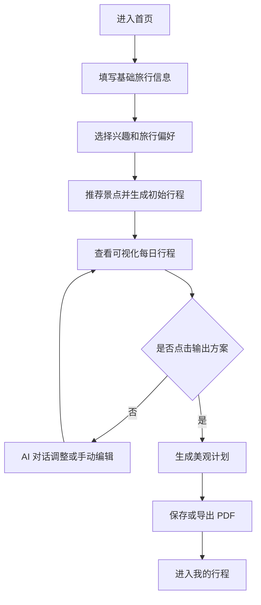

# 智能旅行规划助手产品立项文档 v0.1

> ⚠️ **这是 2026-08 立项期的产品文档，记录最初的定位与范围推演。**
> 与 PRD 有相当篇幅重叠（目标用户、页面清单、数据结构草案各有一份），
> 两份都保留是因为它们对应两个阶段：立项在先，PRD 在后。
> 当前实现请看根目录 `README.md`。

## 1. 项目概述

### 1.1 项目名称

智能旅行规划助手

后续可在品牌设计阶段再命名，例如：

- TripCraft
- RoamPlan
- 旅程工坊
- 行程织造机

### 1.2 项目类型

个人学习与作品集项目。

本项目目标不是一开始验证完整商业模式，而是完整实践一个互联网产品从产品定义、用户体验设计、Figma 原型、前端实现、后端实现、AI 能力接入到最终 Demo 展示的流程。

### 1.3 产品定位

一个以“AI 协作生成 + 可视化行程表”为核心的智能旅行规划工具。

用户输入人数、目的地、旅行天数、兴趣偏好、旅行节奏和自定义需求后，系统自动推荐合适的景点，并结合地图位置、路线耗时和天气信息生成初始旅行计划。用户可以继续通过 AI 对话调整计划，也可以像编辑日程表一样修改景点、时间和顺序，最终生成一份包含地图、路线、时间、天气、每日安排和预算概览的美观旅行计划，并支持导出为 PDF。

### 1.4 一句话描述

帮自由行用户从简单偏好输入开始，和 AI 一起生成一份美观、可编辑、可导出的旅行计划。

## 2. 项目背景

### 2.1 用户现状

自由行用户在旅行前通常需要在多个平台之间反复切换：

- 小红书、抖音、B 站：找攻略和种草内容
- 大众点评、Google Maps、高德地图：找景点、餐厅和评价
- 携程、飞猪、Booking、Agoda：查酒店和价格
- 备忘录、Excel、Notion：整理行程
- 地图 App：估算路线和通勤时间

这个过程信息密度很高，但结果往往仍然混乱。用户需要自己判断景点是否顺路、时间是否合理、预算是否超出、每天是否太累。

### 2.2 机会点

AI 能快速整合用户偏好并生成初稿，但单纯聊天式输出存在明显问题：

- 生成结果不够结构化，难以编辑
- 用户想修改局部内容时，容易整份行程被重写
- 景点、交通、预算、时间安排之间缺少清晰关系
- 不适合作为最终旅行计划使用

因此，本项目不做纯“聊天问答助手”，而是做“偏好输入 + AI 生成 + AI 对话调整 + 可视化行程表 + PDF 导出”的旅行计划工作台。

## 3. 目标用户

### 3.1 核心用户

第一阶段聚焦年轻自由行用户。

典型特征：

- 年龄：20-35 岁
- 出行方式：自由行
- 旅行时长：2-5 天城市旅行
- 计划习惯：会查攻略，但不想花太多时间整理
- 数字工具熟悉度：熟悉小红书、地图、Notion、日历类工具
- 需求倾向：希望有一个不错的初稿，再自己微调

### 3.2 典型用户画像

用户 A：周末短途旅行者

- 计划去上海玩 3 天
- 想吃本地美食、逛街、看展
- 不想行程太赶
- 希望 10 分钟内得到一份初步计划

用户 B：出境自由行新手

- 计划去东京 4 天
- 不熟悉城市分区和交通
- 害怕每天路线安排不合理
- 希望系统自动按区域规划每天活动

用户 C：作品集目标用户

- 面试官、导师或同学
- 关注项目完整性、产品逻辑、交互设计和技术落地
- 需要快速理解项目价值、用户流程和最终效果

## 4. 用户痛点

### 4.1 信息分散

用户需要从多个平台搜集景点、餐厅、酒店、交通和攻略，整理成本高。

### 4.2 行程难以平衡

用户很难同时兼顾兴趣、时间、路线、预算和体力强度。

### 4.3 攻略内容不可执行

很多攻略是经验分享，不是可以直接使用的日程表。用户仍需要自己转化成每天几点去哪里、停留多久、怎么去。

### 4.4 AI 聊天结果难编辑

聊天式 AI 可以生成计划，但用户想“换掉第二天下午的景点”或“把节奏放慢一点”时，缺少可控的编辑体验。

## 5. 产品目标

### 5.1 学习目标

- 完整实践产品立项、PRD、用户流程、信息架构、交互设计和视觉设计
- 使用 Figma 完成核心页面设计和可点击原型
- 通过 vibecoding 完成前端页面、后端接口和 AI 行程生成能力
- 形成一个可以放入作品集展示的完整案例

### 5.2 用户目标

- 用户可以在几分钟内生成一份结构化旅行计划
- 用户可以清晰查看每日安排、推荐景点、地图位置、路线耗时、天气提示、交通建议和预算概览
- 用户可以通过 AI 对话继续调整计划，也可以对行程进行局部编辑
- 用户可以将最终计划导出为一份适合查看、分享和作品集展示的 PDF

### 5.3 产品目标

第一版重点验证：

- AI 能否根据用户偏好生成有质量的推荐景点和初始行程
- 地图路线和天气信息能否帮助行程从“好看”变得“可执行”
- AI 对话调整和手动编辑能否形成自然的协作体验
- 可视化行程表是否比纯聊天结果更适合承载旅行计划
- 用户是否能顺利完成“输入需求 -> 生成计划 -> 多轮 AI 调整/手动编辑 -> 点击输出方案 -> 生成美观计划 -> 导出 PDF”的完整流程

## 6. 产品范围

### 6.1 MVP 范围

第一版必须包含：

- 创建旅行计划
- 收集旅行偏好
- 自动推荐景点
- AI 生成结构化行程
- AI 对话调整行程
- 展示每日行程时间线
- 展示地图概览
- 展示路线耗时和景点顺序
- 展示天气提示
- 编辑行程项目
- 替换或重新生成单个行程项目
- 查看预算概览
- 保存行程
- 导出 PDF

### 6.2 暂不包含

第一版暂不做：

- 真实机票、酒店预订
- 复杂社交分享
- 多人协作编辑
- 真实支付
- 实时导航级地图路线
- 高精度实时天气和营业时间校验
- 移动端 App 原生开发

说明：MVP 中需要展示地图点位、路线顺序、景点间预计耗时和天气概览，但不要求实现实时导航、拥堵预测或导航级路线纠偏。地图、路线和天气优先面向“规划判断”和“计划展示”，不是替代地图 App 导航。

## 7. 核心使用场景

### 7.1 创建行程

用户进入产品后，输入：

- 人数
- 目的地
- 出行日期或旅行天数
- 预算
- 兴趣偏好
- 旅行节奏
- 必去景点
- 不想去的景点
- 自定义偏好

系统推荐适合的景点，并生成一份初始旅行计划。

### 7.2 查看行程

用户在结果页查看：

- 每日主题
- 上午、下午、晚上安排
- 每个景点的推荐理由
- 地图点位
- 景点间路线和预计耗时
- 当日天气
- 建议停留时间
- 交通提示
- 预算估算

### 7.3 编辑行程

用户可以在行程结果页反复编辑和调整，直到认为方案可以输出。编辑方式包括：

- 删除某个景点
- 替换某个景点
- 调整景点顺序
- 修改停留时间
- 重新生成某一天
- 添加自定义景点或备注
- 通过 AI 对话表达调整需求，例如“第二天轻松一点”“多加一些美食”“减少购物”

每次调整后，系统都回到新的行程结果状态，用户可以继续查看、编辑、追问和局部重生成。这个过程可以重复多轮，不强制用户一次确认。

### 7.4 输出方案

用户完成调整后，主动点击“输出方案”。系统将当前行程整理成美观的旅行计划视图。每一天对应一张清晰的计划表，包含：

- 日期和天气
- 当日主题
- 时间线安排
- 地图概览
- 路线摘要
- 景点卡片
- 预算估算
- 交通提示

### 7.5 保存与导出

用户保存最终行程，并可以在“我的行程”里再次打开，也可以导出为 PDF。

作品集版本可重点展示生成前后的交互流程和最终视觉效果。

## 8. 核心用户流程



## 9. 功能模块

### 9.1 创建计划模块

功能说明：

- 收集目的地、日期、人数、预算等基础信息
- 通过表单降低用户输入成本
- 支持用户用自然语言补充需求

关键字段：

- destination
- startDate
- endDate
- travelers
- budget
- pace
- interests
- mustVisit
- avoid
- notes

### 9.2 偏好选择模块

功能说明：

- 用标签化方式收集用户兴趣
- 减少用户写长文本的压力

兴趣标签示例：

- 美食
- 博物馆
- 自然风景
- 城市漫步
- 购物
- 夜生活
- 亲子
- 摄影
- 小众景点
- 地标打卡

旅行节奏：

- 轻松
- 适中
- 紧凑

### 9.3 AI 行程生成模块

功能说明：

- 根据用户输入推荐景点并生成结构化 JSON
- 按天、时间段、景点组织内容
- 给出推荐理由、地图点位、天气提示、交通提示、预算估算

输出要求：

- 内容必须结构化
- 每天安排不能过满
- 同一天景点应尽量顺路
- 每个项目需要有可展示字段

### 9.4 AI 对话调整模块

功能说明：

- 用户可以用自然语言继续调整旅行计划
- 系统将用户意图转化为局部修改
- 避免每次调整都重写整份计划
- 支持多轮迭代，直到用户主动点击“输出方案”

典型指令：

- “第二天不要太赶”
- “多安排一些当地美食”
- “把博物馆换成适合拍照的地方”
- “预算控制在 3000 元以内”

### 9.5 行程表模块

功能说明：

- 以每日时间线展示行程
- 支持切换日期
- 支持编辑、删除、替换和重排
- 每一天形成一张美观、可展示、可导出的计划表

主要 UI：

- 日期 Tabs
- Day Summary
- Timeline Item
- Place Card
- Map Preview
- Weather Badge
- Budget Summary
- Action Toolbar

### 9.6 行程编辑模块

功能说明：

- 对单个行程项目进行局部操作
- 保持用户的控制感

操作包括：

- 替换景点
- 修改时间
- 修改备注
- 删除项目
- 添加项目
- 重新生成当天计划

### 9.7 地图、路线与天气模块

功能说明：

- 展示每天的地点分布
- 帮助用户理解路线是否顺路
- 计算相邻景点之间的距离、交通方式和预计耗时
- 展示当天基础天气信息，辅助用户判断衣物、室内外安排和出行节奏

MVP 应实现：

- 每个景点具备经纬度
- 每天展示景点点位和访问顺序
- 景点之间展示预计交通时间和距离
- 每天展示天气概览
- 可通过高德 API 获取 POI、经纬度和路线信息
- 可通过独立天气 API 获取天气信息

MVP 暂不要求：

- 实时导航
- 实时拥堵预测
- 多交通方式复杂比价
- 海外地图路线完整覆盖

### 9.8 PDF 导出模块

功能说明：

- 将最终旅行计划导出为 PDF
- 每一天对应一张清晰的计划页或计划卡
- 适合作品集展示、分享和打印

导出内容：

- 行程封面
- 每日计划表
- 地图概览
- 路线摘要
- 天气提示
- 预算汇总
- 旅行备注

### 9.9 我的行程模块

功能说明：

- 展示用户保存的行程列表
- 支持重新打开和继续编辑

作品集 MVP 可以先使用本地数据或简单后端存储。

## 10. 页面清单

### 10.1 首页 / 创建行程页

目标：

- 让用户快速开始创建旅行计划

核心内容：

- 产品名称
- 人数选择
- 目的地输入
- 旅行天数或日期选择
- 预算输入
- 兴趣快速选择
- 旅行节奏选择
- 生成按钮

### 10.2 偏好设置页

目标：

- 收集影响行程质量的关键偏好

核心内容：

- 兴趣标签
- 旅行节奏
- 人数和同行人类型
- 必去景点
- 不想去景点
- 额外说明
- 自定义偏好

### 10.3 生成中页面

目标：

- 给用户明确等待反馈

核心内容：

- 当前生成步骤
- 轻量动效
- 规划提示

生成步骤示例：

- 分析旅行偏好
- 筛选合适景点
- 安排每日路线
- 匹配天气和地图信息
- 估算预算和时间

### 10.4 行程结果页

目标：

- 展示和编辑旅行计划，作为用户反复打磨方案的主工作台

核心内容：

- 每日 Tabs
- 时间线
- 地图概览
- 路线摘要
- 天气提示
- 景点卡片
- 行程概览
- 预算概览
- AI 调整输入框
- 编辑操作
- 输出方案按钮

### 10.5 景点详情弹窗

目标：

- 展示单个景点的详细信息

核心内容：

- 景点名称
- 推荐理由
- 建议停留时间
- 预算
- 交通提示
- 用户备注

### 10.6 输出方案 / 每日计划导出预览页

目标：

- 展示用户点击“输出方案”后的最终计划视觉效果

核心内容：

- 每日一张计划表
- 日期、天气和城市信息
- 时间线安排
- 地图概览
- 路线摘要
- 景点与交通信息
- 预算和备注
- 导出 PDF 按钮

### 10.7 我的行程页

目标：

- 管理已保存的旅行计划

核心内容：

- 行程列表
- 目的地
- 日期
- 预算
- 最近编辑时间
- 继续编辑入口

## 11. MVP 数据结构草案

```json
{
  "tripId": "trip_001",
  "destination": "Tokyo",
  "startDate": "2026-08-12",
  "endDate": "2026-08-15",
  "travelers": 2,
  "budget": 8000,
  "pace": "balanced",
  "interests": ["food", "city_walk", "anime", "shopping"],
  "days": [
    {
      "day": 1,
      "date": "2026-08-12",
      "weather": {
        "condition": "晴",
        "temperatureRange": "24-31°C",
        "tip": "适合城市步行，建议携带防晒用品。"
      },
      "theme": "浅草与上野的城市初体验",
      "summary": "以经典地标和轻松散步为主，适合抵达后的第一天。",
      "items": [
        {
          "id": "item_001",
          "startTime": "10:00",
          "endTime": "11:30",
          "title": "浅草寺",
          "type": "attraction",
          "durationMinutes": 90,
          "reason": "适合第一次到东京的经典文化体验。",
          "location": {
            "address": "东京都台东区浅草 2-3-1",
            "latitude": 35.7148,
            "longitude": 139.7967
          },
          "estimatedCost": 0,
          "transportTip": "从酒店乘地铁约 25 分钟。",
          "notes": ""
        }
      ],
      "routeSummary": {
        "totalDistanceKm": 6.8,
        "totalTransportMinutes": 55,
        "segments": [
          {
            "from": "浅草寺",
            "to": "上野公园",
            "mode": "transit",
            "distanceKm": 2.7,
            "durationMinutes": 18
          }
        ]
      }
    }
  ],
  "budgetSummary": {
    "food": 1800,
    "transport": 600,
    "tickets": 700,
    "shopping": 2000,
    "other": 900
  }
}
```

## 12. 设计方向

### 12.1 产品气质

关键词：

- 清晰
- 可信
- 可控
- 轻量
- 有旅行感但不过度装饰

### 12.2 视觉建议

适合方向：

- 类日历 / 任务管理工具的结构感
- 旅行地图和目的地图片作为辅助信息
- 干净的白底或浅色背景
- 用不同颜色区分美食、景点、交通、购物等类别

避免方向：

- 只做成大面积营销型落地页
- 过度依赖聊天气泡
- 行程卡片信息堆叠太密
- 视觉像普通攻略列表而不是规划工具

## 13. 技术实现建议

### 13.1 前端

建议技术栈：

- Next.js 或 React
- Tailwind CSS
- Zustand 或 React Context
- shadcn/ui 可选
- 地图和路线能力建议优先接入高德 API
- 天气能力建议接入独立天气 API

第一阶段前端目标：

- 先用 Mock 数据完成完整体验
- 再接入后端 API
- 保证行程编辑交互顺滑
- 在行程结果页展示地图点位、路线顺序、天气和交通耗时

### 13.2 后端

建议技术栈：

- Node.js + Express/NestJS，或 Python + FastAPI
- PostgreSQL 或 Supabase
- OpenAI API 生成结构化行程
- 高德 API 获取 POI、经纬度和路线规划
- 独立天气 API 获取城市天气和日期天气概览

核心接口：

- POST /api/trips/generate
- POST /api/trips/pois/search
- POST /api/trips/routes/calculate
- GET /api/weather
- GET /api/trips
- GET /api/trips/:id
- POST /api/trips
- PATCH /api/trips/:id
- POST /api/trips/:id/regenerate-day
- POST /api/trips/:id/items/:itemId/replace

### 13.3 AI 能力

第一版 AI 重点：

- 生成结构化 JSON 行程
- 根据用户偏好控制节奏
- 结合路线耗时优化每天的景点顺序
- 结合天气提示调整室内外安排
- 支持局部重新生成
- 输出稳定字段，方便前端渲染

高德 API 在第一版承担：

- 景点 POI 搜索与基础信息补全
- 景点经纬度获取
- 景点间路线规划
- 预计交通时间和距离计算

天气 API 在第一版承担：

- 城市天气查询
- 旅行日期范围天气概览
- 天气状态、温度区间和出行提示数据支持

后续增强：

- 联网查询景点信息
- 接入营业时间
- 接入实时拥堵和更复杂交通策略
- 根据用户编辑行为优化推荐

## 14. 成功指标

作为作品集项目，建议指标分为体验指标和展示指标。

### 14.1 体验指标

- 用户能在 3 分钟内完成一次行程生成
- 用户能理解每个页面的下一步操作
- 用户能完成至少 3 种编辑操作
- 行程结果具备清晰的每日结构

### 14.2 作品集指标

- 能展示完整产品流程
- 能说明为什么选择“可编辑行程表”而不是“聊天助手”
- 能展示 Figma 原型和最终实现之间的对应关系
- 能展示 AI 结构化输出如何支撑前端体验
- 能说明 MVP 范围取舍

## 15. 项目里程碑

### 阶段 1：产品定义

产出：

- 产品立项文档
- MVP 功能范围
- 用户流程图
- 页面清单

### 阶段 2：PRD 与交互设计

产出：

- 详细 PRD
- 页面状态说明
- 核心交互说明
- 异常状态说明

### 阶段 3：Figma 原型

产出：

- 低保真线框图
- 高保真核心页面
- 组件库
- 可点击原型

### 阶段 4：前端实现

产出：

- 可运行前端 Demo
- Mock 数据行程
- 创建、查看、编辑行程流程

### 阶段 5：后端与 AI 接入

产出：

- 生成行程 API
- 保存行程 API
- 高德 POI 和路线接口接入
- 天气 API 接入
- 局部重新生成能力
- 前后端联调

### 阶段 6：作品集包装

产出：

- 项目说明页
- 产品决策说明
- Figma 截图
- Demo 链接
- 技术实现说明

## 16. 风险与应对

### 16.1 AI 输出不稳定

应对：

- 使用严格 JSON Schema
- 前端增加兜底字段
- 后端做数据校验和修复

### 16.2 功能范围过大

应对：

- MVP 只做城市短途旅行
- 不做预订和支付
- 地图路线只做规划级耗时和路线摘要，不做实时导航
- 天气只做城市级或日期级概览，不做高精度分钟级预报

### 16.3 设计过于像普通攻略 App

应对：

- 强调时间线和编辑能力
- 首页直达创建流程
- 结果页以行程工作台为核心

### 16.4 技术落地时间不可控

应对：

- 前端先 Mock
- 后端先做最小 API
- AI 先生成静态结构化行程，再做局部重生成功能

## 17. 下一步行动

下一步进入 PRD 和 Figma 前置设计。

建议优先完成：

1. 明确产品名称和目标用户表述
2. 绘制核心用户流程
3. 拆解行程结果页的信息层级
4. 输出低保真页面草图
5. 定义 AI 生成行程的 JSON Schema

当前最关键的设计问题：

- 用户第一次进入产品时，应该看到“创建工具”还是“示例行程”？
- 偏好收集应该放在一页完成，还是拆成两步？
- 行程结果页中，时间线、地图、预算三者的优先级如何排列？
- 编辑操作应该偏直接操作，还是通过弹窗完成？
